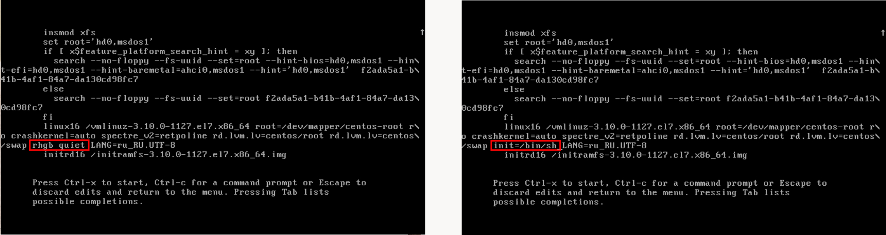
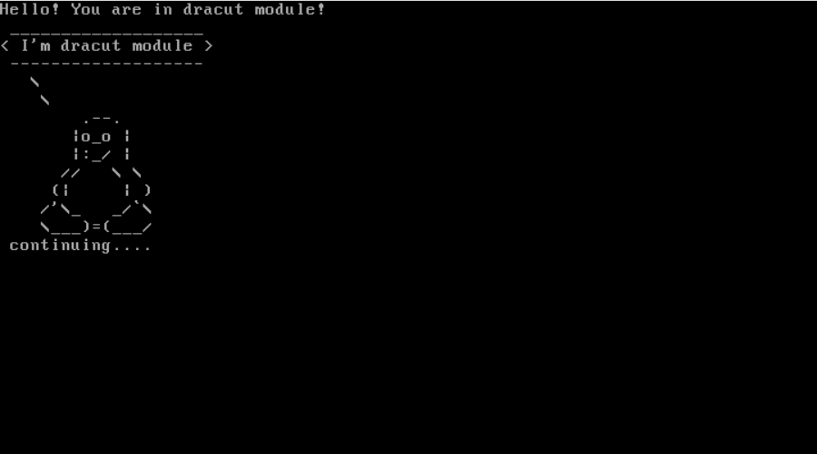

### Стенд для загрузки системы.

#### Три способа загрузки системы в однопользовательском режиме.

Однопользовательский режим, также называемый режимом обслуживания, который позволяет одному суперпользователю восстанавливать / исправлять системные проблемы.
Этот метод в основном полезен в тех случаях, когда вы хотите запустить fsck, чтобы исправить поврежденные файловые системы, или сбросить забытый пароль root, или исправить проблему с точкой монтирования в системе.

##### Способ №1: Загрузим систему в однопользовательском режиме, заменим слово «rhgb quiet» на параметр init=/bin/sh» в ядре.

При загрузки системы, на экране загрузки GRUB2 нажмем клавишу "E", чтобы отредактировать выбранные параметра ядра. Заменим «rhgb quiet» на параметр init=/bin/sh» в ядре и нажмем сtrl-x для загрузки в систему. Смонтирует наш раздел «/» в режим READ и WRITE (RW), чтобы внести изменения.

```
# mount -o remount,rw /
```
Теперь можем выполнить любую задачу, которую захотим. К примеру сменим пароль root.
```
# passwd root
# touch /.autorelabel
```
Перезагружаем систему
```
# exec /sbin/init
```
##### Способ №2: Загрузить систему в однопользовательском режиме, добавим в ядро параметр «rd.break».

Запустим систему и отредактируем выбранный параметр ядра, добавим параметр rd.break и нажимаем сtrl-x для загрузки в систему. Смонтирует наш раздел «/» в режим READ и WRITE (RW), чтобы внести изменения.

```
# mount -o remount,rw /sysroot
# chroot /sysroot
# passwd root
# touch /.autorelabel
```
Перезагружаем систему
```
# reboot -f
```
##### Способ №3: Загрузить систему в однопользовательском режиме, заменим слово «ro» на параметр «rw init=/sysroot/bin/sh» в ядре.

Запустим систему и отредактируем выбранный параметр ядра, добавим параметр rw init=/sysroot/bin/sh и нажимаем сtrl-x для загрузки в систему.

```
# passwd root
# touch /.autorelabel
```
Перезагружаем систему
```
# reboot -f
```

#### Установить систему с LVM, после чего переименуем VG.
Для этого нам нужно vagrantfile с системой LVM. Первым делом посмотрим текущее состояние системы:
```
# vgs
```
```
VG		#PV	#LV	#SN	Attr	VSize	VFree
VolGroup00	1	2	0	wz--n-	<38.97g	   0 
```
Переменуем группу VolGroup00 на OtusRoot
```
# vgrename VolGroup00 OtusRoot
```
Далее правим /etc/fstab, /etc/default/grub, /boot/grub2/grub.cfg c VolGroup00 на OtusRoot
```
# vi /etc/fstab
```
командой меняем :%s/VolGroup00/OtusRoot/g
```
# vi /etc/default/grub
```
командой меняем :%s/VolGroup00/OtusRoot/g
```
# vi /boot/grub2/grub.cfg
```
командой меняем :%s/VolGroup00/OtusRoot/g

Пересоздаем initrd image, чтобы он знал новое название Volume Group
```
# mkinitrd -f -v /boot/initramfs-$(uname -r).img $(uname -r)
```
Проверяем
```
# vgs
```
```
VG		#PV	#LV	#SN	Attr	VSize	VFree
OtusRoot	1	2	0	wz--n-	<38.97g	   0 
```
#### Добавить модуль в initrd

Скрипты модулей хранятся в каталоге /usr/lib/dracut/modules.d/. Для того чтобы
добавить свой модуль создаем там папку с именем 01test:
```
# mkdir /usr/lib/dracut/modules.d/01test
```

module-setup.sh - который устанавливает модуль и вызывает скрипт test.sh
```
# vi /usr/lib/dracut/modules.d/01test/module-setup.sh
```
```
#!/bin/bash

check() {
    return 0
}

depends() {
    return 0
}

install() {
    inst_hook cleanup 00 "${moddir}/test.sh"
}
```
```
# chmod +x /usr/lib/dracut/modules.d/01test/module-setup.sh
```
test.sh - собственно сам вызываемый скрипт, в нём у нас рисуется пингвинчик
```
# vi /usr/lib/dracut/modules.d/01test/test.sh
chown +x /usr/lib/dracut/modules.d/01test/test.sh
chmod +x /usr/lib/dracut/modules.d/01test/test.sh
```
```
#!/bin/bash

exec 0<>/dev/console 1<>/dev/console 2<>/dev/console
cat <<'msgend'
Hello! You are in dracut module!
 ___________________
< I'm dracut module >
 -------------------
   \
    \
        .--.
       |o_o |
       |:_/ |
      //   \ \
     (|     | )
    /'\_   _/`\
    \___)=(___/
msgend
sleep 10
echo " continuing...."
```
Пересобираем образ initrd
```
# mkinitrd -f -v /boot/initramfs-$(uname -r).img $(uname -r)
# dracut -f -v
```
Можно проверить/посмотреть какие модули загружены в образ:
```
# lsinitrd -m /boot/initramfs-$(uname -r).img | grep test
```
После перезагрузки системы, можно увить наш модуль.


Ссылка на дополнительную информацию
- [Три способа загрузки систем CentOS / RHEL 7/8 в однопользовательском режиме
](https://itsecforu.ru/2020/04/29/%F0%9F%90%A7-%D1%82%D1%80%D0%B8-%D1%81%D0%BF%D0%BE%D1%81%D0%BE%D0%B1%D0%B0-%D0%B7%D0%B0%D0%B3%D1%80%D1%83%D0%B7%D0%BA%D0%B8-%D1%81%D0%B8%D1%81%D1%82%D0%B5%D0%BC-centos-rhel-7-8-%D0%B2-%D0%BE%D0%B4/)


